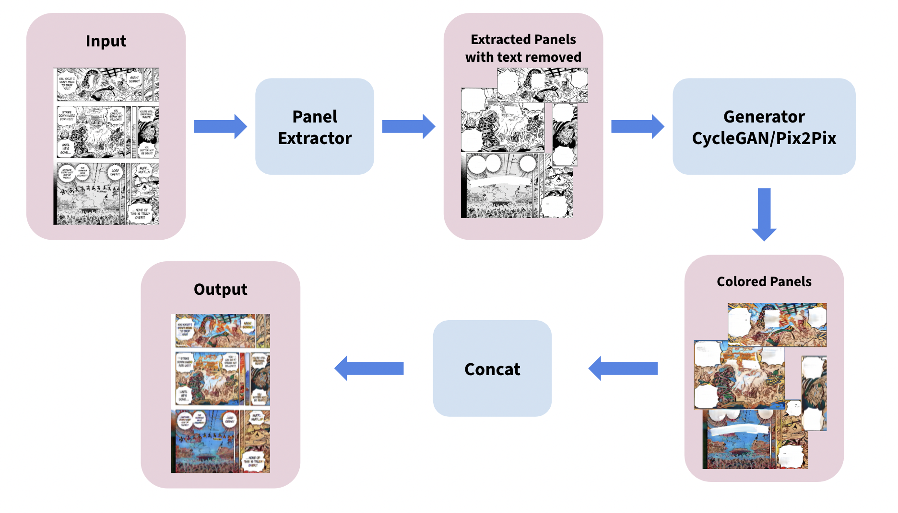

# Manga Colorization

This repository hosts the code for training and applying generative models for manga colorization. It includes implementations for CycleGAN and Pix2Pix models, allowing for experimentation and fine-tuning to achieve high-quality colorized manga panels.


## Project Structure

1. **Manga Panel Extraction**
    - **Script**: `Manga_Panel_Extractor/panel_extractor.py`
    - **Description**: Extracts individual manga panels from manga pages. This script is essential for preparing the data for training and inference processes.

2. **Pix2Pix Model**
    - **Training Script**: `Pix2Pix_Model/train.py`
    - **Test Script**: `Pix2Pix_Model/panel_test.py`
    - **Description**: Use these scripts to fine-tune or train the Pix2Pix generator, and to test the colorization of manga panels using the Pix2Pix model as the generator.

3. **CycleGAN for Manga Colorization**
    - **Training Notebook**: `Manga_CycleGAN/manga-colorization-training.ipynb`
    - **Main Script for Colorization**: `colorize_main.py`
    - **Description**: The Jupyter notebook is used for training the CycleGAN model for manga colorization. Use the main script to apply the trained CycleGAN model to colorize manga panels.

## Setup and Requirements

To get started, clone this repository and install the required packages:

```bash
git clone <repository-url>
cd <repository-name>
pip install -r requirements.txt
```

Make sure to prepare your environment to support the necessary libraries, particularly those for deep learning such as TensorFlow or PyTorch, depending on which model backend you are using.

## Usage

### Manga Panel Extraction

To extract manga panels from provided manga pages:

```bash
python Manga_Panel_Extractor/panel_extractor.py --input_dir /path/to/manga/pages --output_dir /path/to/output/panels
```

### Training the Pix2Pix Model

To train or fine-tune the Pix2Pix model:

```bash
python Pix2Pix_Model/train.py --data_dir /path/to/training/data --output_dir /path/to/save/model
```

### Testing the Pix2Pix Model

To test the colorization using the Pix2Pix model:

```bash
python Pix2Pix_Model/panel_test.py --model_path /path/to/pix2pix/model --test_dir /path/to/test/panels
```

### Training the CycleGAN Model

Open and run the Jupyter notebook for training the CycleGAN model:

```bash
jupyter notebook Manga_CycleGAN/manga-colorization-training.ipynb
```

### Colorizing with the CycleGAN Model

To colorize manga panels using the trained CycleGAN model:

```bash
python colorize_main.py --model_path /path/to/cyclegan/model --input_dir /path/to/manga/panels --output_dir /path/to/colorized/panels
```
