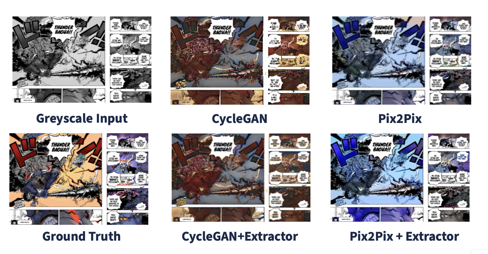

# Manga Colorization

This work does not propose a novel method; instead, it investigates a straightforward, incremental, yet valuable downstream application of current popular generative models, considering the recent advancements in this field. While end-to-end training of generative models has become highly mature and robust, there are few studies exploring the performance of fine-tuning these models for more challenging tasks, such as manga colorization, especially under limited computational resources. In this work, we utilize pre-trained GAN-based models and address the distribution differences between task-specific inputs and pre-training data, allowing for more efficient fine-tuning. We observe that applying a manga extractor to our input images before feeding them into the generator yields a notable performance boost. We hope this work will provide useful insights and experience for future research.


## Result
Below is an illustrative example comparing the output images generated by different model designs:


We used the Fréchet Inception Distance (FID) as our evaluation metric, as it is commonly used in generative model assessments.

| Model                   | FID   |
|-------------------------|-------|
| Fine-tuned CycleGAN     | 74.25 |
| Fine-tuned Pix2Pix      | 44.02 |
| CycleGAN w/ Extractor   | 65.54 |
| Pix2Pix w/ Extractor    | 48.49 |


## Insights
Based on the results, several key insights can be drawn regarding the performance of different models for manga colorization:

1. **Model Performance**:
   - **Fine-tuned Pix2Pix**: Achieved the best performance with an FID score of 44.02, indicating high-quality colorized outputs closely matching the ground truth.
   - **Fine-tuned CycleGAN**: Had the highest FID score of 74.25, showing it is less effective for this task compared to Pix2Pix.

2. **Impact of Extractor**:
   - **CycleGAN with Extractor**: Improved performance (FID 65.54) compared to the standard CycleGAN but still lagged behind Pix2Pix models.
   - **Pix2Pix with Extractor**: Surprisingly showed a performance drop (FID 48.49), suggesting the extractor may introduce noise or lose important global context.

3. **Comparison of Model Approaches**:
   - **Pix2Pix vs. CycleGAN**: Pix2Pix models consistently outperformed CycleGAN models, suggesting that paired data (Pix2Pix) is more effective for manga colorization than domain mappings (CycleGAN). This is likely because manga styles vary greatly, and paired data better captures these inconsistencies.

4. **Challenges and Considerations**:
   - **Diverse Manga Styles**: Each manga has a unique style, and capturing this diversity requires sophisticated tuning and more computational resources.
   - **Global Context Loss**: The inclusion of extractors can sometimes lead to a loss of global context, impacting performance.

## Project Structure

1. **Manga Panel Extraction**
    - **Script**: `Manga_Panel_Extractor/panel_extractor.py`
    - **Description**: Extracts individual manga panels from manga pages. This script is essential for preparing the data for training and inference processes.

2. **Pix2Pix Model**
    - **Training Script**: `Pix2Pix_Model/train.py`
    - **Test Script**: `Pix2Pix_Model/panel_test.py`
    - **Description**: Use these scripts to fine-tune or train the Pix2Pix generator, and to test the colorization of manga panels using the Pix2Pix model as the generator.

3. **CycleGAN for Manga Colorization**
    - **Training Notebook**: `Manga_CycleGAN/manga-colorization-training.ipynb`
    - **Main Script for Colorization**: `colorize_main.py`
    - **Description**: The Jupyter notebook is used for training the CycleGAN model for manga colorization. Use the main script to apply the trained CycleGAN model to colorize manga panels.

## Setup and Requirements

To get started, clone this repository and install the required packages:

```bash
git clone <repository-url>
cd <repository-name>
pip install -r requirements.txt
```

Make sure to prepare your environment to support the necessary libraries, particularly those for deep learning such as TensorFlow or PyTorch, depending on which model backend you are using.

## Usage

### Manga Panel Extraction

To extract manga panels from provided manga pages:

```bash
python Manga_Panel_Extractor/panel_extractor.py --input_dir /path/to/manga/pages --output_dir /path/to/output/panels
```

### Training the Pix2Pix Model

To train or fine-tune the Pix2Pix model:

```bash
python Pix2Pix_Model/train.py --data_dir /path/to/training/data --output_dir /path/to/save/model
```

### Testing the Pix2Pix Model

To test the colorization using the Pix2Pix model:

```bash
python Pix2Pix_Model/panel_test.py --model_path /path/to/pix2pix/model --test_dir /path/to/test/panels
```

### Training the CycleGAN Model

Open and run the Jupyter notebook for training the CycleGAN model:

```bash
jupyter notebook Manga_CycleGAN/manga-colorization-training.ipynb
```

### Colorizing with the CycleGAN Model

To colorize manga panels using the trained CycleGAN model:

```bash
python colorize_main.py --model_path /path/to/cyclegan/model --input_dir /path/to/manga/panels --output_dir /path/to/colorized/panels
```
